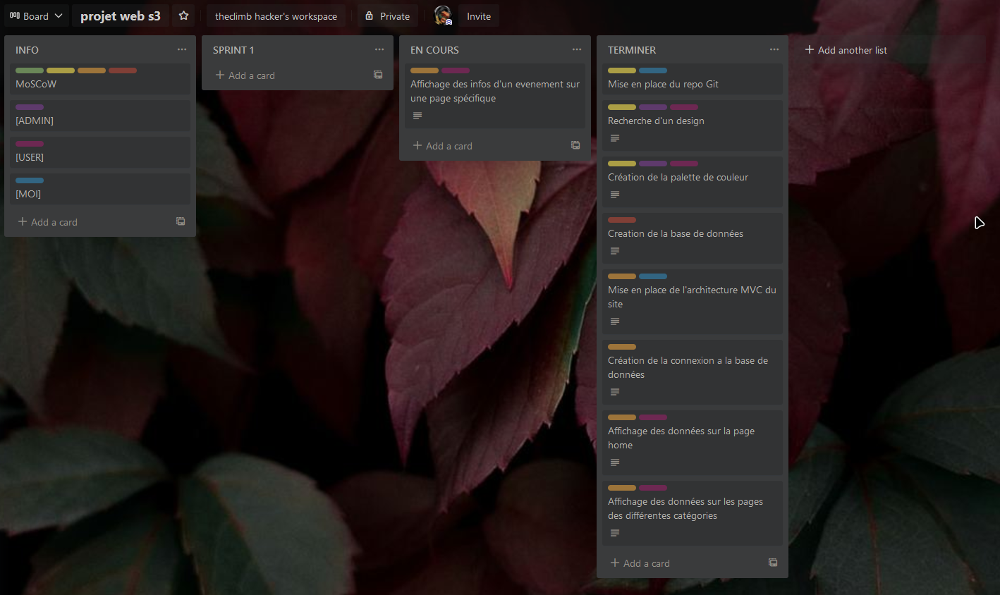

# projet-web-s3
 
Ce site à été réalisé dans le cadre du projet de fin du semestre 3 en Mineure WEB.

Le projet consistait en la création d'un site en PHP permetant la réservation de billets dans la thématique de l'art et/ou du spectacle.
Le site devait inclure un panel admin ainsi qu'un système de connexion pour les utilisateurs.

Une demo du site est disponible à cette adresse http://www.wordus.xyz

Il était également impposé que le projet contienne un backlog avec des userstory. J'ai décidé de faire le mien via l'application en ligne Trello il est disponible avec le lien suivant https://trello.com/invite/b/ePyZs6Md/42444ee6649b9135a34652f1c8bbacd8/projet-web-s3

Raillard Arsène (Hokanosekai)
